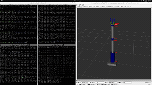
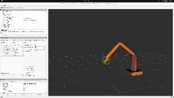
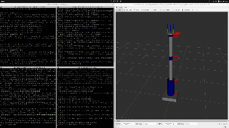
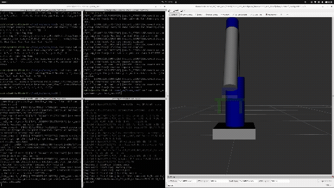
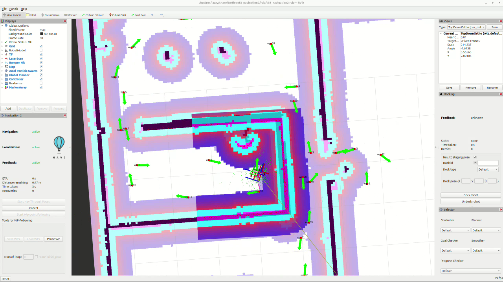

# learn_ros2 — Robotics Portfolio

<p align="center">
  
  
  
  
  
  
</p>

## Overview

This repo is my hands‑on journey through **ROS 2 simulation and control**, from fundamentals to full navigation and motion planning. It contains clean, minimal examples in **C++ and Python**, plus small, visual **final projects** to show the concepts in action. The goal is simple: **demonstrate practical robotics skills quickly, with visuals**.

**Repo structure (top‑level):**

```
course_level1/    # Core ROS 2 nodes in C++/Python + final projects
course_level2/    # URDF, TF, RViz, Gazebo; sensor sim + bringup
course_level3/    # Actions, lifecycle, components, executors + final project
course_moveit/    # MoveIt planning (URDF->SRDF, planning groups, API demos)
course_nav2/      # SLAM & Nav2 with TurtleBot3 in Gazebo + mapping & nav
course_ros2_control/ # (Next up) ROS 2 Control hardware interfaces & controllers
docs/             # GIFs, videos, screenshots, certificates
```

> Courses: by **Edouard Renard** (Level 1, 2, 3, MoveIt, Nav2). Last one left: **ros2_control**.

---

## Visual Highlights

<p align="center">
  
  
</p>

<p align="center">
  
  
</p>

---

## Quick Start

```bash
# 1) Clone & build
git clone https://github.com/cedrichld/learn_ros2
cd learn_ros2
colcon build --symlink-install

# 2) Source
source install/setup.bash

# 3) Pick a demo (examples below)
# Level 1 turtle (Python)
ros2 run final_project_py_course1 turtle_controller

# Level 2 bringup + Gazebo (example)
ros2 launch course_level2_bringup simulation.launch.py

# Level 3 final project (C++)
ros2 run final_proj3_cpp final_project_node

# MoveIt quick demo (API motion)
ros2 launch robot_arm_bringup demo.launch.py

# Nav2 TB3 mapping/navigation (Gazebo)
ros2 launch nav2_turtlebot3_learning navigation2.launch.py use_sim_time:=True \
  map:=src/nav2_turtlebot3_learning/maps/my_map.yaml
```

> **Note:** Some demos assume you have the TurtleBot3, Gazebo, and MoveIt dependencies installed and your `GAZEBO_MODEL_PATH`/TB3 env vars set.

---

## Next up: **ros2_control** (Hardware Interfaces & Controllers)

**Focus (planned):**

* **Skills:** hardware_interface, controller_manager, joint state/effort/velocity interfaces, `ros2_control` YAMLs, gazebo‑ros2‑control bridge, PID tuning.
* **Outcome:** bring a custom URDF robot to life with **trajectory controllers** (follow_joint_trajectory) and **position/velocity controllers** in simulation.

> Folder: `course_ros2_control/` (Scaffold in place; implementation next.)

---

## MoveIt — Motion Planning & Manipulation

**Folders:** `course_moveit/robot_arm_*`, `robot_arm_moveit_config`

**What I learned:**

* **URDF → SRDF pipeline:** joints, collision pairs, and **planning groups**.
* **Planning scene & kinematics:** IK queries, **Cartesian paths**, constraints.
* **MoveGroup API (C++/Python):** plan, execute, async stops, trajectory inspection.
* **Trajectory concepts:** time parameterization, joint limits, smoothing.

**Mini demos:**

<p align="center">
  
</p>
<p align="center">
  
</p>
<p align="center">
  
</p>

**Final activity:** build a small **arm commander** that sequences joint targets and a short **Cartesian segment**, with collision‑aware planning and graceful stop on preemption.

---

## Nav2 — SLAM & Navigation

**Folders:** `course_nav2/nav2_turtlebot3_learning`, `turtlebot3_gz_sim`

**What I learned:**

* **Mapping & Localization:** `slam_toolbox`, AMCL, static maps.
* **Nav2 stack:** `bt_navigator`, `planner_server`, `controller_server`, recovery.
* **Behavior Trees:** swapping **planner/controller** plugins without code changes.
* **Costmaps:** global/local, inflation, footprint tuning, voxel/obstacle layers.

**Final demo:** **Map my apartment** in Gazebo, then navigate between waypoints with obstacle inflation set for safe clearances.

<p align="center">
  
  
</p>

---

## ROS 2 Advanced (Level 3) — Actions, Lifecycle, Components, Executors

**Folders:** `course_level3/*`

**What I learned:**

* **Actions (C++/Py):** goal/feedback/result APIs for long‑running tasks.
* **Lifecycle Nodes:** managed bringup, deterministic configuration & cleanup.
* **Components:** composition, intra‑process comms, lower latency & memory.
* **Executors:** single vs multi‑threaded, callback groups, real‑time behavior.

**Final project:** compose a multi‑node app with **lifecycle‑managed** sensing and a **C++ action server** coordinating a task; verify reconfiguration without process restarts.

<p align="center">
  
  
  
</p>

---

## Level 2 — URDF, TF, RViz, Gazebo

**Folders:** `course_level2/*`

**What I learned:**

* **URDF/Xacro:** links/joints, inertia, collision vs visual, macros.
* **TF tree:** frame conventions, static vs dynamic transforms.
* **RViz:** visual debugging with TF, markers, point clouds.
* **Gazebo:** spawn, sensors, plugins; launch files for **bringup**.

**Final project:** complete robot description and **simulate sensors**; verify TF tree and visualize in RViz.

<p align="center">
  
</p>

---

## Level 1 — Core ROS 2 (C++ & Python)

**Folders:** `course_level1/*`

**What I learned:**

* **Nodes, topics, services, parameters, timers** in C++ & Python.
* **Messages & interfaces:** custom `.msg/.srv` with `rosidl`.
* **Packages & launch:** `ament_cmake` and `ament_python` basics.

**Mini finals:**

<p align="center">
  
  
</p>

---

## Tech Stack & Skills

* **ROS 2 Jazzy**, **C++17/20**, **Python 3.12**
* **MoveIt**, **Nav2**, **Gazebo (Ignition)**, **RViz**
* **URDF/Xacro**, **TF2**, **ros2_control** (in progress)
* **Actions, Lifecycle, Components, Executors**

---

## Certificates

* Certificates available in `docs/Certificates of Completion/`.

---

<p align="center"><i>Maintained by Cedric Hollande.</i></p>
